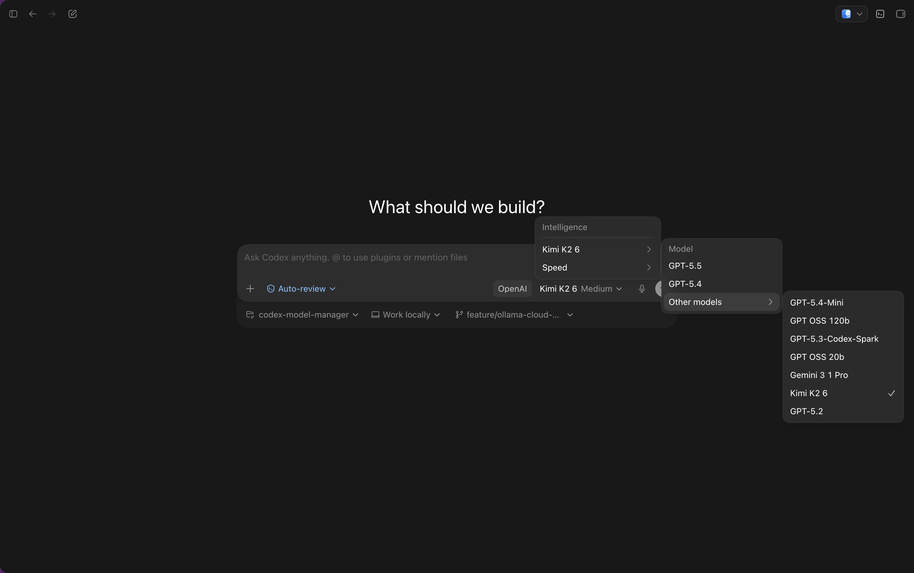

<p align="center">
  
</p>

<h1 align="center">Codex Model Manager</h1>

<p align="center">
  Load balancer for ChatGPT accounts that allow you to have different models from providers such as OpenRouter, Ollama CLoud and OpenCode Zen alongside your ChatGPT accounts.
</p>

<p align="center">
  <a href="https://github.com/lobbystack/codex-model-manager/releases">
    
  </a>
  <a href="https://github.com/lobbystack/codex-model-manager/actions/workflows/release.yml">
    
  </a>
  
  
</p>

Codex Model Manager gives you a single control surface for model
routing, provider keys, Codex config, usage, and cost visibility. It is inspired by Codex-lb with the additional capability of having other providers than OpenAI.

If you find yourself changing you config.toml file again and again, or having to switch between Codex and OpenCode or Claude Code, this is for you.

## Preview



The app is intentionally quiet: provider status, model routing, proxy health,
usage, and install/update controls are visible without turning the dashboard into
a marketing page.

## Quick Start

Release builds install as a local browser app. The installer creates a versioned
app directory, starts a background service, and opens the dashboard.

**macOS and Linux**

```bash
curl -fsSL https://raw.githubusercontent.com/lobbystack/codex-model-manager/main/scripts/install.sh | CMM_GITHUB_REPO=lobbystack/codex-model-manager sh
```

**Windows PowerShell**

```powershell
$env:CMM_GITHUB_REPO="lobbystack/codex-model-manager"; irm https://raw.githubusercontent.com/lobbystack/codex-model-manager/main/scripts/install.ps1 | iex
```

Requirements:

- Node.js 20 or newer
- Port `1455` available on localhost
- A published GitHub Release for installer-based installs

After install, open:

```text
http://localhost:1455
```

## Why Use It?

Codex and OpenCode are most useful when model routing is boring. In practice,
local setups can drift:

- Provider keys live in different shells, config files, and dashboards.
- Codex model providers require TOML edits that are easy to forget or mistype.
- Model IDs differ between ChatGPT, OpenRouter, OpenCode, and OpenAI-compatible
  APIs.
- Usage and estimated spend are hard to inspect after requests leave your tool.

Codex Model Manager keeps those concerns in one local app. Connect providers,
choose the models you want exposed, install the Codex config, and point clients
at one localhost proxy.

## Features

| Feature | What it gives you |
| --- | --- |
| Local browser dashboard | Manage providers, models, proxy status, and usage from `localhost:1455`. |
| Provider management | Connect ChatGPT/Codex accounts, OpenRouter API keys, OpenCode Zen API keys, and Ollama Cloud API keys. |
| Codex config installer | Adds the local proxy provider to `~/.codex/config.toml` with a backup. |
| OpenAI-compatible proxy | Exposes `/v1/models`, `/v1/responses`, and `/v1/chat/completions`. |
| Codex backend proxy | Supports `/backend-api/codex` routes used by Codex-style clients. |
| Usage and cost visibility | Tracks requests, tokens, estimated API cost, real user cost, and errors. |
| Local-first storage | Stores account/provider data under `~/.codex-model-manager` by default. |
| Prompted updates | Release builds check GitHub Releases and ask before updating. |

## Supported Providers

| Provider | How it works |
| --- | --- |
| ChatGPT / Codex account | Browser OAuth or device sign-in, using the registered localhost callback. |
| OpenRouter | Save an API key and expose selected OpenRouter models through the local proxy. |
| OpenCode Zen | Save an API key and route OpenCode Zen models through the same dashboard. |
| Ollama Cloud | Save an API key and route Ollama Cloud models through the same dashboard. |
| OpenAI-compatible clients | Point clients at the local `/v1/*` proxy endpoints. |

Environment variables are still supported for server-side fallback:

```bash
OPENROUTER_API_KEY=...
OPENCODE_ZEN_API_KEY=...
OLLAMA_API_KEY=...
CMM_OPENAI_KEYS=...
OPENAI_API_KEY=...
```

## Proxy Endpoints

Codex Model Manager runs both the UI and proxy on the same TanStack Start server.

| Endpoint | Purpose |
| --- | --- |
| `GET /health` | Proxy health check. |
| `GET /v1/models` | OpenAI-compatible model list. |
| `POST /v1/responses` | OpenAI Responses-style proxy route. |
| `POST /v1/chat/completions` | Chat Completions-style proxy route. |
| `GET /backend-api/codex/models` | Codex-style model catalog. |
| `POST /backend-api/codex/responses` | Codex-style Responses proxy route. |

Requests must include a string `model` field that matches an enabled model in
the dashboard.

## Built For Local-First AI Development

The app is designed to run on your laptop, not as a hosted control plane. Browser
OAuth uses:

```text
http://localhost:1455/auth/callback
```

Local data is stored here by default:

```text
~/.codex-model-manager
```

Codex config integration targets:

```text
~/.codex/config.toml
```

You can override these paths with environment variables such as `CMM_DATA_DIR`,
`CMM_ENCRYPTION_KEY_FILE`, and `CMM_CODEX_CONFIG_PATH`.

## Tech Stack

| Layer | Technology |
| --- | --- |
| App framework | TanStack Start |
| UI | React 19, TypeScript, Tailwind CSS v4 |
| Components | Base UI, shadcn-style local components, lucide-react |
| Runtime/build | Bun, Vite, Nitro |
| Routing | TanStack Router file routes |
| Distribution | GitHub Releases, one-command installers, prompted updates |
| Storage | Local JSON files with encrypted provider/account tokens |

## Development

Install dependencies and start the unified UI/proxy server:

```bash
bun install
bun run dev
```

The dev server runs on:

```text
http://localhost:1455
```

If port `1455` is already in use, the installed background app is probably still
running. Stop it before starting the dev server:

**macOS (installer)**

```bash
launchctl unload ~/Library/LaunchAgents/com.codex-model-manager.app.plist
```

Start it again later:

```bash
launchctl load ~/Library/LaunchAgents/com.codex-model-manager.app.plist
```

If the port is still busy:

```bash
lsof -ti :1455 | xargs kill
```

Production build:

```bash
bun run build
bun run start
```

Verification:

```bash
bun run typecheck
bun run lint
bun run build
```

Proxy smoke test:

```bash
curl http://localhost:1455/health
curl http://localhost:1455/v1/models
```

## Release Packaging

Prepare the release package:

```bash
bun run build
bun run package:release
```

The packaging script writes `release/package`. The GitHub release workflow
archives that package for macOS, Linux, and Windows, publishes checksums, and
generates `codex-model-manager-manifest.json` for prompted updates.

## Troubleshooting

**Browser OAuth fails**

Browser OAuth must return to `http://localhost:1455/auth/callback`. Stop any
server using another port and restart Codex Model Manager on `1455`.

**The installer cannot find a release**

The one-command installer downloads from GitHub Releases. Publish a tagged
release first, then rerun the installer.

**Port `1455` is already in use**

Stop the installed background app on macOS:

```bash
launchctl unload ~/Library/LaunchAgents/com.codex-model-manager.app.plist
```

If the port is still busy:

```bash
lsof -ti :1455 | xargs kill
```

The default OAuth callback expects port `1455`.

**Node version errors**

Install Node.js 20 or newer. The release server runs the generated Nitro Node
entrypoint.

**Where is data stored?**

Provider/account data is stored under `~/.codex-model-manager` unless
`CMM_DATA_DIR` is set. Codex config changes are written to `~/.codex/config.toml`
with a timestamped backup.

## Project Status

Codex Model Manager is early and intentionally focused: local provider
management, model routing, usage visibility, and Codex/OpenCode proxy support.
The project is moving toward simple laptop distribution with GitHub
Release-based updates.
